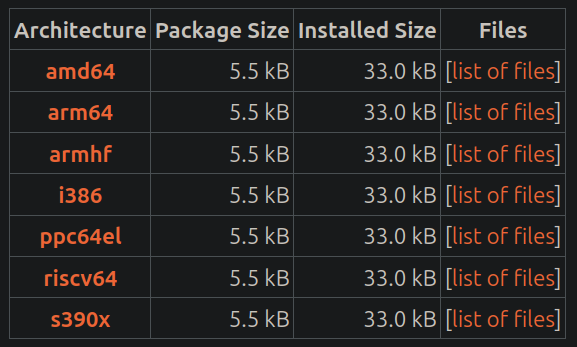
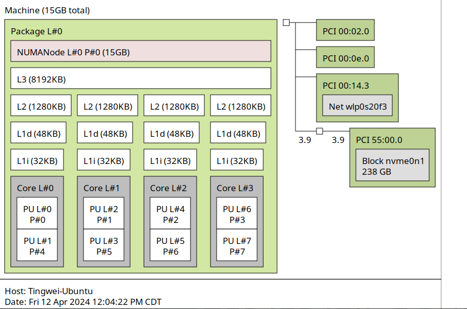

## Check Sys Architecture

- A few methods possible. 
- Looked at all to find convergence.

### M1- Application Binary Interface (ABI)

```{bash}
dpkg --print-architecture #amd64
dpkg-architecture -q DEB_BUILD_ARCH #amd64
file -Lb /usr/bin/ld | cut -d, -f2 #x86_64 simply confirms system files were built on a 64bit arch
#NOTES:
#software is built for different architectures (cpu and os architectures)
#ideally 64 bit cpus can run 64 or 32 bit OSs.
#this cmd checks to see if the OS type is 32 or 64 bit. amd64 adopted by intel is backward compatible with x86 or 32 bit OSs.
#match binaries to the OS type (64 bit).
#amd64 replaces IA-64 (Itanium) from intel. IA-64 is found in super computers.
```



### M2-arch

```{bash}
arch #x86_64 (x86_64 = intel); 64 bit support
```

### M3-lscpu

```{bash}
lscpu | grep Architecture #Architecture:x86_64 (x86_64 = intel); 64 bit support
```


### M4-uname

```{bash}
uname --machine
uname -m #x86_64 (x86_64 = intel); 64 bit support
#alternate output here for intel processors will be i386 a metonymy of IA-32.
```

### M4-hardware platform

```{bash}
uname --hardware-platform
uname -i #x86_64 (x86_64 = intel vs authenticAMD = AMD)
uname --processor #confirms vendor
#detects the cpu vendor.
```

### C++ Approach

```{Rcpp}
#include <iostream>
using namespace std;

int main() {
    if ( SIZE_MAX == 0xFFFFFFFF ) {
      cout << "32 bit";
    } else if ( SIZE_MAX == 0xFFFFFFFFFFFFFFFF ) {
      cout << "64 bit";
    } else {
      cout << "Unknown";
    }
    return 0;
}
```


### CPU Topology

```{bash}
sudo apt install hwloc
lstopo
```

